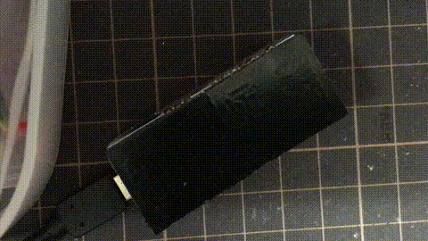

mqtt-14seg.ino
====
This sketch displays a message to Adafruit 14-Seg LED via MQTT.

  - Adafruit 14-Segment Alphanumeric LED FeatherWing 
    - https://www.adafruit.com/product/3089
    - https://learn.adafruit.com/14-segment-alpha-numeric-led-featherwing/usage

How to
----

Requirements

  - Adafruit-GFX-Library
    - https://github.com/adafruit/Adafruit-GFX-Library
  - Adafruit-LED-Backpack-Library
    - https://github.com/adafruit/Adafruit_LED_Backpack/

Configuration

    $ git clone https://github.com/yoggy/mqtt-14seg.git
    $ cd mqtt-14seg.git
    $ cp config.ino.sample config.ino
    $ vi config.ino
    ※ edit mqtt_host, mqtt_username, mqtt_password, topic...
    $ open mqtt-14seg.ino

Copyright and license
----
Copyright (c) 2018 yoggy

Released under the [MIT license](LICENSE)
